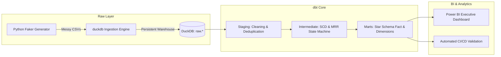

# 🚀 Modern SaaS Analytics Engineering Pipeline

An end-to-end analytics engineering pipeline simulating an enterprise B2B SaaS data warehouse. This project models complex subscription lifecycles, MRR retention accounting, and payment operations using **DuckDB**, **dbt Core**, and **Power BI**, fully validated through **GitHub Actions CI**.

---
## 🏗️ Architecture & Tech Stack



* **Storage & Warehouse Engine:** [DuckDB](https://duckdb.org/) (High-performance columnar OLAP embedded database)
* **Transformation & Data Modeling:** [dbt Core](https://www.getdbt.com/) (`v1.8+`) with medallion architecture
* **Data Synthesis:** Python (`pandas`, `faker`, `numpy`)
* **Visualization & BI:** Microsoft Power BI Desktop
* **Orchestration & CI/CD:** GitHub Actions
---

## 📊 Dimensional Modeling & Schema Design

The transformation layer models raw events into a star-schema marts layer optimized for reporting:

| Model | Type | Grain | Key Metrics & Dimensions |
| :--- | :--- | :--- | :--- |
| **`dim_customers`** | Dimension | Customer ID | `lifetime_value`, `acquisition_channel`, `country`, `cohort_month`, `is_active` |
| **`dim_plans`** | Dimension | Plan ID | `plan_name`, `tier`, `monthly_price`, `billing_interval` |
| **`fct_mrr_by_month`** | Fact | Month | `new_mrr`, `expansion_mrr`, `contraction_mrr`, `churned_mrr`, `reactivation_mrr`, `ending_mrr` |
| **`fct_churn`** | Fact | Churn Event | `customer_id`, `plan_id`, `tier`, `churned_mrr`, `cohort_month` |
| **`fct_payments`** | Fact | Transaction | `amount`, `status`, `payment_method`, `is_successful_payment` |

---

## 📈 Executive Power BI Dashboard

The semantic layer feeds an executive dashboard monitoring revenue velocity, customer retention, and unit economics:


### Key Business Metrics Tracked
* **Ending MRR Growth:** Point-in-time monthly recurring revenue tracking revenue velocity up to **$372.27K**.
* **MRR Movements Waterfall:** Component-level monthly revenue bridge (New, Expansion, Contraction, Churn, and Reactivation).
* **Tiered Revenue Churn:** Volume and dollar value of lost revenue segmented across plan tiers.
* **Customer LTV:** Aggregate customer lifetime value (**$4.94M**) across distinct acquisition funnels.

---

## 💡 Engineering Challenges, Mistakes & Lessons Learned

### 1. Handling Concurrency Locks with DuckDB & Power BI
* **The Problem:** Power BI loads queries concurrently using multiple background mashup processes (`Microsoft.Mashup.Container.NetFX45.exe`). DuckDB's default file connection operates in exclusive Read-Write mode, triggering `IO Error: Cannot open file ... process cannot access the file because it is being used by another process`.
* **The Root Cause:** Passing standard parameter strings like `read_only=true` failed with `[01S09] Invalid keyword: 'read_only'`.
* **The Solution:** DuckDB ODBC requires explicit syntax: `access_mode=read_only;`. Terminating hung background processes and passing `access_mode=read_only` allowed concurrent read evaluations across all fact/dim tables without locking.

### 2. Point-in-Time Snapshot Metrics vs. Additive Totals
* **The Problem:** Plotting `ending_mrr` on a line chart using Power BI's automatic date hierarchy summed each month's ending balance across entire calendar years, yielding inflated figures (~$32.78M).
* **The Lesson:** While revenue movements (`new_mrr`, `churned_mrr`) are **additive**, ending balances (`ending_mrr`) are **semi-additive point-in-time snapshots**. The visualization required removing the date hierarchy drilldown and tracking chronological `event_month` sequences.

### 3. Star Schema vs. Cartesian Fan-Outs in BI Visuals
* **The Problem:** Adding dimension slices to measure cards without active relationship filtering caused non-related measures to duplicate across categories.
* **The Lesson:** Clean dimensional modeling requires strict foreign key relationships and explicitly separated DAX measures (`DIVIDE`, `CALCULATE`, `LASTNONBLANK`) to prevent fan-outs.

### 4. Cleaning Synthetic "Dirty" Data in the Staging Layer
* **The Design:** The ingestion generator deliberately introduced duplicate rows, trailing whitespace, casing mismatches, and overlapping subscription timestamps.
* **The Lesson:** The staging models (`stg_*`) strictly handled technical cleaning (window function deduplication via `ROW_NUMBER() OVER (PARTITION BY ...)` and standardizing timestamps), isolating messy raw data from business logic in the intermediate layer.

---

## ⚙️ Quickstart & Local Setup

### 1. Clone Repository & Setup Virtual Environment
```bash
git clone [https://github.com/](https://github.com/)<your-username>/analytics-ecommerce.git
cd analytics-ecommerce/saas-analytics-pipeline
python -m venv .venv
source .venv/bin/activate  # On Windows: .venv\Scripts\Activate.ps1
pip install -r requirements.txt
```

### 2. Ingest Data & Run Transformations
```bash
# Load raw synthetic files into DuckDB
python warehouse/load_raw.py

# Run transformations and data quality tests
cd dbt_project
dbt build --profiles-dir .
```

### 3. Connect Power BI
1. Open Power BI Desktop.
2. Select **Get Data → ODBC**.
3. Under **Advanced Options**, enter the connection string:
   ```text
   Driver=DuckDB Driver;Database=<ABSOLUTE_PATH_TO_saas_warehouse.duckdb>;access_mode=read_only;
   ```
4. Load the 5 mart tables and open `dashboards/saas_analytics_report.pbix`.

---

## 🛡️ Data Quality & Automated CI

This project enforces production data quality standards on every pull request:
* **Unique & Not-Null Constraints:** Applied across all primary keys (`customer_id`, `plan_id`, `subscription_id`, `payment_id`).
* **Accepted Values:** Verified for payment statuses (`succeeded`, `failed`, `refunded`) and subscription tiers.
* **Relationship Integrity:** Referential integrity tests between foreign keys in facts and their respective dimension tables.
* **Continuous Integration:** A GitHub Actions workflow automatically spins up Python, builds the DuckDB instance, runs all dbt transformations, and validates all dbt test suites on commit.
